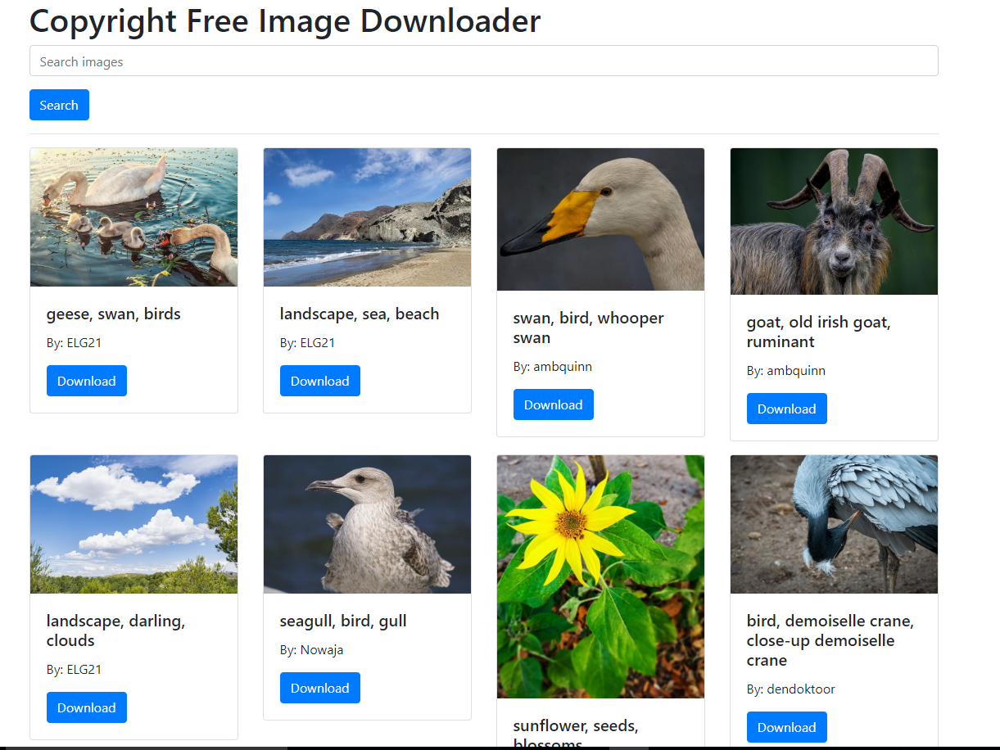

# Project Name

## Description

The Pixabay Clone project aims to create a website that allows users to search and download free high-quality images, just like the popular website Pixabay. To achieve this, the project will use the Pixabay API, which provides access to millions of images, videos, and vector graphics.

The website will be built using PHP and Bootstrap, two widely used technologies in web development. PHP will be used to create the back-end of the website, handling user requests and interactions with the Pixabay API. Bootstrap, on the other hand, will be used to create a responsive and modern-looking front-end design that can be easily customized.
## Features

## List of features the project has to offer
-Image search: Users can search for images using keywords or phrases. The search results will be displayed as a grid of thumbnail images, along with basic information about each image such as the title, author, and number of downloads.

-Image preview: When a user clicks on an image in the search results, a larger preview of the image will be displayed, along with additional information such as the image's resolution, file type, and tags.

-Image download: Users can download images in various sizes and formats, including small, medium, and large JPEG files, as well as PNG and SVG files. The website will provide a download link for each image that the user selects.

-Image sharing: Users can share images on social media platforms such as Facebook and Twitter, using the built-in sharing buttons on the website.

-User registration and login: Users can create an account on the website, allowing them to save their favorite images and keep track of their download history.

## Installation

- Instructions on how to install and run the project

## Usage

- Examples on how to use the project

## Contributing

- Guidelines for contributing to the project
- Information on how to set up a development environment

## License

- Information about the project's license

## Contact

- Contact information for the project's maintainers

## Acknowledgements

- Credits to the people whose work was used in the project
- Any additional acknowledgements

### Perview Image:

Feel free to customize this template to fit your project's needs!
